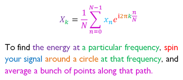

```{r setup, include=FALSE}
knitr::opts_chunk$set(echo = FALSE)
```

## Welcome

## What we think of when we talk about synthesizers {data-background="Yamaha_DX7_Table_4.JPG"}

## What is sound?

## {data-background="Spherical_pressure_waves.gif"}

## Sine wave

```{r}
library(tibble)
library(ggplot2)
x <- seq(0,50,.1)
tb = tibble(x = x,y = sin(x))
ggplot(tb, aes(x = x, y = y)) +
  geom_line() + xlab("time") +
  ylab("amplitude") +
  theme(axis.ticks = element_blank(),
        axis.text = element_blank())
```

## Another sine wave

```{r}
library(tibble)
library(ggplot2)
x <- seq(0,50,.1)
tb = tibble(x = x,y = -sin(x))
ggplot(tb, aes(x = x, y = y)) +
  geom_line() +
  xlab("time") +
  ylab("amplitude") +
  theme(axis.ticks = element_blank(),
        axis.text = element_blank())
```


## All together now

```{r}
library(tibble)
library(ggplot2)
x <- seq(0,50,.1)
tb <- tibble(x = x, y = sin(x), z = factor("a"))
tb <- add_row(tb, x = x, y = -sin(x), z = factor("b"))
tb <- add_row(tb, x = x, y = sin(x)-sin(x), z = factor("sum"))
ggplot(tb, aes(x=x, y=y, color=z)) +
  geom_line() +
  xlab("time") +
  ylab("amplitude") +
  theme(axis.ticks = element_blank(),
        axis.text = element_blank(),
        legend.title = element_blank())
```


## More waves {data-background="Waveforms.svg"}

## {data-background="ADSR_parameter.svg"}

## The frequency domain

The Fourier Transform



## Filters

## "patch"

**a.** _trans_. To connect by a temporary electrical, radio, or telephone connection; (also) to represent or simulate by means of temporary connections; usu. with _in_, _into_, _through_; _spec_.  _(a)_ to connect (a telephone call, or the person making it) to a telephone circuit;  _(b)_ to set the controls of (a synthesizer) so as to produce a particular sound; to produce (a sound) by this means. **to patch out:** to disconnect from a circuit by diverting current through a temporary connection.

[1923   _Bell Syst. Techn. Jrnl._ **2** 123   In open-wire installations it has been the practice to equip each line circuit..with a full complement of jacks suited to provide the maximum degree of flexibility in ‘patching’.] 